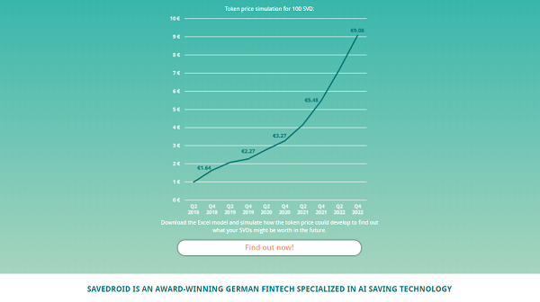

_The Art of the Steal - The Scammers' Big Lies_

# Awesome Initial Coin Offerings (ICO) Truths 

## Big Lie #1 - ICO tokens are like bitcoins

Bitcoins get "mined" with every new block every ten minutes. You CANNOT buy newly minted bitcoins.
The bitcoin "lottery" gives away FREE bitcoins
to the lucky winner / number every ten minutes with every block added for the next TWENTY YEARS.

Why a lottery? A random (secure) lottery - using the famous proof-of-work hashing crypto "puzzle" -
is the fairest distribution between all network nodes / peers / players.

vs

App tokens do NOT get mined. You can create / mint as many tokens as you like!
Just punch / type in a number - lets say two billion.
Sell off 30% in an "initial coin offering" (ICO) / token sales to greater fools
in a free money get-rich-quick cash grab running for lets say two or three weeks
and keep the rest "in reserve" for yourself.

It's that easy and with the ready-to-use/ready-to-run Ethereum blockchain / network
you're off in ten minutes!

Free easy money! Buyer beware! Do NOT get scammed by the promise of returns of 50 000% on your "investment"
and the fear of missing out (FOMO) on the next bitcoin.

What Trolly McTrollface says to "ICOs are like Bitcoin / BTC":

## Big Lie #2 - ICOs are like IPOs

Initial Coin Offerings are nothing like Initial Public Offerings (IPOs).
In an IPO a company goes public on a stock exchange selling shares - usually it's a great way for (well-connected and rich) 
insiders to get-rich-quick.

ICOS suggest that now the small fish / fry can get-rich-quick too. Everyone can buy ICO token with the illusion
to get-rich-quick.

Why are ICOs scams?

If you buy these digital tokens (on the blockchain) giving free money
as a donation / gift to a company to revolutionize
the world one block at a time than everything is ok.

If you buy these digital token (on the blockchain) trying to get rich (quick)
by selling them at a higher price to a greater fool than - surprise, surprise -
you're getting scammed.

Let's quote the fineprint from the "Legal FAQ" from a "standard" token sale:

> HERO - in whatever form – do NOT represent a claim on or against Byte Heroes, Inc.
> Byte Heroes, Inc. may decide NOT to exchange HEROs - in whatever form - at ANY time at their sole discretion.
> [Thanks for the free money and holding the bag!]
>
> -- Source: Hero Legal FAQ

The point is ... you own binary bits (on the blockchain) and
the value is ... excactly zero.  You say? Wait, but the token value is not (yet) excactly zero.
HODL! HODL! How much richer are you today?

Ask yourself why should the company work hard, hard, hard to make you rich, rich, rich
when - surprise, surprise - the company already collected all the free money from greater fools
and  - surprise, surprise - you have zero legal claim to anything.
Welcome to the world of business! Buyer beware!

## Big Lie #3 - ICO token go to the moon (like bitcoin)! Once-In-A-Lifetime Return-on-Investment (ROI) 50 000%

Making 50 000% Returns on ICO "Investments" - Possible? Spoiler: No. It's bullshit / a scam.

Buyer beware! If it sounds too good to be true, - surprise, surprise - it is.
The Future is Bright! Free Easy Money Bullshit (BS) Example - [Early Investors are making 50 000% returns on ICOs](https://hackernoon.com/investors-are-making-50-000-returns-on-icos-32432bc741d1) by Coin and Crypto.

> Early investment is paying off big time
>
> The average return on the S&P is 10%. Over the last year bitcoin has seen unprecedented returns of 1000%. 
> But savvy cryptocurrency investors are investing in initial coin offerings (ICOs) 
> and making return on investments (ROIs) 
> as high as 50 000%. Stop and think about that for a moment. That means for a $100 investment in early 2017
> you could have netted $50 000. Not too shabby for a year of trading.
> 
> [..]
>
> The majority of startups fail, even well funded ones,
> so be prepared to lose [all] what you invest [gamble], 
> even if the landscape is optimistic. [To the moon! Thanks for your money and hodling the bag!] 

From the Savedroid White Paper:

## Big Lie #4 - ICO White Papers and Roadmaps with Milestones are like "Due Diligence" Investor Prospectus

ICO White Papers are fiction. Wishful thinking.

Revolutionize Crowdfund / Savings / E-Sports Betting / Tourism / Business-to-Business (B2B) Commerce
and on and on and last but not least Philosopher's Stone / Alchemy. Yeah, sure.

_Milestones, Milestones, Milestones_

From the Savedroid White Paper:

Self-Learning Secret-Sauce Artificial Intelligence (AI) Black-Box - Magic Savedroid (SVD) Gold Mine Bullshit - Scam Alert! Scam Alert! Scam Alert!

2022  -- Self-learning AI algorithm enabling world peace / paradise providing
free easy money for everyone

2024  -- Self-learning AI algorithm enabling singularity. Machines scam the mere mortal human dummies
and run off with the free easy money. Your savings are gone

## Big Lie #5 - ICO are endorsed by serious honest successful businessmen/women "advisors" (and A-B-C-celebrities) - Think-Yourself-Rich-Like-Us - Be a Winner

These serious honest succesful businessmen/women "advisors" (and A-B-C-celebrities)
are smiling on the promotion brochure (white paper) because the get paid big time
without (shame on you!) disclosing that they are paid shills.
A usual endorsement "fee" or gift is about $50 000 or $100 000 or more. Free easy money.

> We set-up a system [free token "bounty" ICO pumping program] where our community members & investors were rewarded
> [free tokens! free tokens! free tokens!]
> for spreading the word [pumping the ICO] by sharing, posting, uploading, joining channels & commenting 
> [in Facebook, Twitter, LinkedIn, YouTube, Personal Blog, Reddit, Bitcoin Talk, ...]. 
> The most common questions here were: "Where do I have to report [to get my free tokens, free money]?", 
> "How much [free tokens, free money] do I get?", 
> "Where do I see how much I already get?" 
> and especially "when are the bounties [free tokens, free money] distributed?".
>
> Source: [Community Management during an ICO, Official Hero Coin Blog](https://medium.com/@HEROCoin/community-management-during-an-ico-3b22624c485a), October 2017

Q: How can you say that these "Platform" Token Sales are Scams? 
Have you read the white paper? Have you seen all these serious honest businessmen/women, 
the management team and all advisors and more than dozens of happy faces in the brochure?

A: Money! Money! Money! Breaking news: Free easy money corrupts.

Breaking news: Building a "platform" to revolutionize the online betting market, tourism, token trading, ...  
you need to work, work, work hard
and - surprise, surprise - you need code monkeys (programmers).
Clicky, clicky, clicky and putting on a great dazzling marketing show is NOT good enough.

Ask these companies and happy faces where's the code, code, code?

Remember: Like secure cryptographic algorithms are by definition open - in the 21st century you can by
definition only
build open decentralized platforms with open (source) code.

Ask these companies where are the daily check-ins, check-ins, check-ins?
Where are the daily commits, commits, commits? (†)

Remember: Running (working) code wins.

Without open (source) code for all to see the white paper promises are just dreams or
let's name it straight - big lies and cash grab scams.
Thanks for the free money and hodling the bag!

## Big Lie #6 - ICO tokens are decentralized like bitcoins 

ICO tokens are centralized tokens managed by a single company on the Ethereum blockchain.
It takes five / twenty / ninety minute to issue / print your own tokens on the Ethereum blockchain
using the Token #20 standard. 
To create your very own token in five minutes you need four pieces:

|                                       | Example        |
|---------------------------------------|----------------|
| 1. Name of the token                  | Your Krypto Token |
| 2. Token symbol (like a stock ticker) | YOU                 |
| 3. Token decimal places (making the token divisible) | 2   |
| 4. Total number of tokens in circulation | 2 100 000 000   |

That's it. See the [Aweomse (Get-Rich-Quick) Tokens](https://github.com/openblockchains/awesome-tokens) page for more.

Note: Usually (only) about 30% of the tokens get sold and - surprise, surprise - the company keeps the rest (70%) in reserve
to "manage" the token supply. Always ready to sell more tokens to greater fools and collect more free money 
or hand out more freebies (to "inflate" the economy) or to pump up the price "burning / using up" some token to deflate the economy.
A free token market certified by Austrian school economics. Yeah, sure. 

## Articles

[**Initial Coin Scams**](https://www.project-syndicate.org/commentary/ico-cryptocurrency-scams-by-nouriel-roubini-2018-05)
by Nouriel Roubini, Project Syndicate, 10 May 2018 -- 
_There are now nearly 1 600 cryptocurrencies, and the number continues to rise. It is time to start recognizing their issuers' utopian rhetoric for what it is: self-serving nonsense meant to separate credulous investors from their hard-earned savings._

[**Buyer Beware: Hundreds of Bitcoin Wannabes Show Hallmarks of Fraud**](https://www.wsj.com/articles/buyer-beware-hundreds-of-bitcoin-wannabes-show-hallmarks-of-fraud-1526573115)
by Shane Shifflett and Coulter Jones, Wall Street Journal (WSJ), 17 May 2018  -- 
_A Wall Street Journal analysis of 1 450 cryptocurrency offerings reveals rampant plagiarism, identity theft & promises of improbable returns._

[**The U.S. Securities and Exchange Commission (SEC) Has an Opportunity You Won't Want to Miss: Act Now!**](https://www.sec.gov/news/press-release/2018-88), 16 May 2018 --
_If you've ever been tempted to buy into a hot investment opportunity the Securities and Exchange Commission (SEC) has a deal for you.
Check out the SEC's Office of Investor Education and Advocacy's initial coin offering (ICO) that touts an all too good to be true investment opportunity.
HoweyCoins.com mimics a bogus coin offering to educate investors
about what to look for before they invest in a scam._

## Best of Disclaimers - Thank You For Your Free Money and HODLing the Bag! 

### Alphachain - Alphaville, Financial Times

> 1. Alphaville may or may not be inclined to build the Alphachain network. This paper does not represent an
>    obligation, promise, duty, suggestion or implied contract to do so.
> 2. The Alphachain tokens do not have any rights, uses, purpose, attributes, functionalities or features, express
>    or implied, including, without limitation, any uses, purpose, attributes, functionalities or features on the Alphachain
>    Platform.
> 3. The proceeds of the Alphachain initial coin offering may be used for any purpose, stated or otherwise.
> 4. Alphachain tokens are not securities, commodities, swaps on either securities or commodities, or similar financial
>    instruments. They are not designed for investment or speculative purposes and should not be considered as a type of
>    investment. The tokens are not available for purchase by the residents of any country.
> 5. The value of tokens may go up, up a lot, up a great deal, or up a tremendous amount. It is also possible they
>    may not, or be subject to diminished prices. No prediction or forecast should be inferred, tendered or predicated on any
>    of the aforementioned statements.
> 6. Alphachain tokens are not emoluments.
>
> (Source: Alphachain White Paper)

## More

See the [Get Rich Quick (Business) Blockchain Bible](https://github.com/bitsblocks/get-rich-quick-bible) -
The Secrets of Free Easy Money -
From Zero to Twenty Million in Three Weeks - To the Moon - Fast Exit - To the Beach.

_Fiction, Fiction, Fiction_

See the [Blockchain White Paper collection](https://github.com/openblockchains/blockchain-whitepapers) 
or the  [Made in Austria edition](https://github.com/austriacodes/blockchain-whitepapers).

## Meta

**License**

The awesome ico truth list / page is dedicated to the public domain. Use it as you please with no restrictions whatsoever.

---

**Disclaimer: Short version: Please think for yourself.** 

**Long version: Nothing contained on these pages is, or should be construed as providing or offering, investment, legal, accounting, tax or other advice. Do not act on any opinion expressed here without consulting a qualified professional. Note: The writers do not hold a position in any crypto tokens or cryptocurrency or blockchain company.**

---

**New to CryptoCurrencies and CryptoTokens?**

**See the [Last Week Tonight with John Oliver (HBO) Video on CryptoCurrencies](https://www.youtube.com/watch?v=g6iDZspbRMg) @ YouTube (30min).**

**Digital currencies and "platform" app tokens 
are generating a lot of get-rich-quick excitement. 
John Oliver enlists Keegan-Michael Key to get potential investors 
equally excited about the concept of caution. Buyer beware!**

